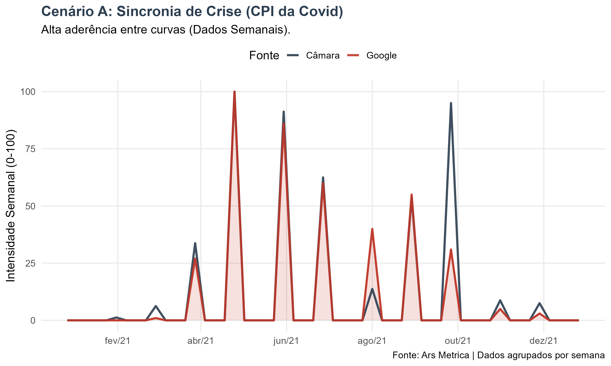
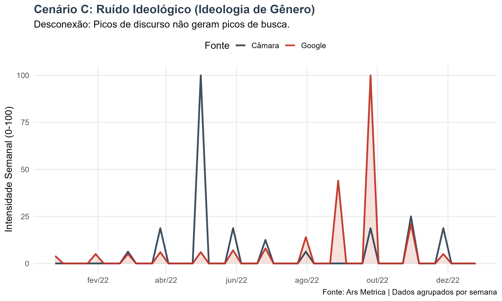

<strong>English Abstract (Click to Expand)</strong>

 
<blockquote>
  
<strong>Parliamentary Discourse vs. Digital Interest: Measuring Political Synchrony</strong>

  
Do politicians truly listen to society? To answer this, I built the <strong>Political Seismograph</strong>, a data pipeline in <strong>R</strong> that correlates Parliamentary Discourse (Supply) with Google Trends search volume (Demand). By analyzing thousands of speeches from the Brazilian Chamber of Deputies, I tested the "representation hypothesis" across three distinct archetypes of public issues.

  
<strong>Key Findings:</strong>

  <ul>
    <li><strong>The Survival Mode (Crisis):</strong> During the Covid CPI investigation (2021), political speech and public interest were strongly correlated (<strong>r=0.73</strong>), with a balanced intensity ratio of <strong>1.11</strong>.</li>
    <li><strong>The Technical Mode (Structural Reform):</strong> On complex topics like Tax Reform (2023), Congress worked autonomously, producing <strong>3.5x more content</strong> than the public demanded.</li>
    <li><strong>The Noise Mode (Culture War):</strong> On moral issues like "Gender Ideology" (2022), there was zero correlation (<strong>r=-0.08</strong>), indicating a "dialogue of the deaf" where speech serves only as position-taking for partisan bases.</li>
  </ul>
</blockquote>

 

### Destaques da Análise
* **Em Crises (CPI):** Alta correlação (**r=0.73**) e volume equilibrado entre discurso e busca.
* **Em Reformas (Tributária):** O Legislativo produz **3,5x mais** conteúdo do que a demanda de busca.
* **Em Pautas Morais (Ideologia):** Correlação nula (**r=-0.08**), indicando agendas paralelas.

---

## O Descompasso da Atenção

Existe uma métrica capaz de definir quando o Congresso Nacional e a sociedade estão, de fato, focados no mesmo assunto?

Na Ciência Política, a teoria do *Agenda Setting* discute historicamente quem pauta quem: é a mídia que pauta o político? É o político que pauta o público? Com a digitalização, ganhamos uma nova camada: a **atenção direta** do cidadão, medida pelos seus rastros de busca.

Para auditar essa relação com dados, desenvolvi o **Sismógrafo Político**. A ferramenta cruza duas bases de dados distintas para testar a hipótese da representação:
1.  **A Oferta (Legislativo):** O volume de discursos proferidos na Câmara dos Deputados.
2.  **A Demanda (Digital):** O volume de buscas no Google (uma *proxy* de curiosidade ou preocupação).

O objetivo não é julgar se o político "trabalha muito ou pouco", mas entender a **natureza da conexão**: em quais momentos o "relógio de Brasília" acerta o passo com o tempo da sociedade?

## Metodologia: Por que os gráficos têm este formato?

Antes de analisar os resultados, é preciso entender o "ritmo" dos dados.

A fala parlamentar obedece a uma **sazonalidade rígida**. A produção legislativa se concentra nas terças, quartas e quintas-feiras, caindo quase a zero nos fins de semana e recessos. Se plotássemos os dados diários brutos, veríamos um gráfico "nervoso", cheio de picos e vales (formato "dente de serra"), que dificultaria a leitura.

Para corrigir isso e revelar a tendência real, nossa metodologia **agrupa os dados semanalmente**. As curvas suaves que você verá abaixo representam o volume consolidado de cada semana, eliminando o ruído diário e permitindo uma comparação limpa entre a pauta do Congresso e o interesse do Google.

::: {.callout-note collapse="true"}
## 🔎 Detalhes Técnicos

Para garantir a robustez da análise, utilizamos o seguinte pipeline em **R**:

1.  **Fonte Oferta (Câmara):** Coleta diária de discursos via API, processados via NLP (n-grams).
2.  **Fonte Demanda (Sociedade):** Volume de busca no Google Brasil via `gtrendsR`.
3.  **Métricas:**
    * **Correlação (r):** Sincronia temporal das curvas semanais.
    * **Índice de Intensidade Relativa ("Bolha"):** Razão entre o volume de discurso e o volume de busca.
    * **Normalização:** Escala Min-Max (0-100) para comparabilidade visual.
:::

## A Seleção dos Arquétipos

Para testar os limites dessa representação, selecionamos três "arquétipos" de problemas públicos baseados na literatura legislativa clássica:

1.  **O Evento de Choque (Crise):** Problemas urgentes e visíveis que exigem resposta imediata (*"Fire Alarm"*).
2.  **A Pauta Estrutural (Reforma):** Problemas complexos, de longo prazo, que exigem negociação técnica.
3.  **A Pauta Simbólica (Guerra Cultural):** Temas morais usados para sinalização de virtude (*"Position Taking"*).

Abaixo, testamos como o Sismógrafo se comporta em cada um desses cenários reais.

---

### 1. Alta Sincronia: O Caso da CPI da Covid
O primeiro teste analisou a **CPI da Covid (2021)**. Este é o arquétipo da **Crise**.

* **Correlação (r):** `0.73` (Alta)
* **Índice de Intensidade:** `1.11` (Equilíbrio)

**Análise:** O índice próximo de 1.0 indica um equilíbrio de atenção. Este é o modo de **"Sobrevivência"** do Legislativo: diante de uma crise visível, a reação institucional é imediata e proporcional à demanda por informação da sociedade. O político precisa falar para mostrar que está agindo.

### 2. Atividade Institucional: A Reforma Tributária
Ao analisarmos a **Reforma Tributária (2023)**, vemos o arquétipo da **Pauta Estrutural**.

* **Correlação (r):** `0.69` (Média)
* **Índice de Intensidade:** `3.57` (Discurso Preponderante)

**Análise:** O índice dispara para **3.57**. A Câmara dedicou quase 4 vezes mais espaço a este debate do que a sociedade demonstrou interesse.
Isso ilustra o papel da **"Democracia Técnica"**. Em pautas complexas (*hard policy*), o Legislativo atua de forma autônoma, ou "insulada", mantendo o debate vivo para construir consensos difíceis, independente da pressão das ruas. O descolamento aqui não é uma falha, mas uma necessidade do processo legislativo.

### 3. Desconexão Temática: Ideologia de Gênero
Por fim, testamos a **Ideologia de Gênero (2022)**, o arquétipo da **Guerra Cultural**.

* **Correlação (r):** `-0.08` (Nula/Negativa)
* **Índice de Intensidade:** `1.22`

**Análise:** A correlação negativa sugere agendas paralelas. Os picos de discurso na Câmara não coincidem com os momentos de busca da sociedade. Isso é clássico do **"Position Taking"**: o discurso não visa informar ou debater uma política pública (policy), mas sim sinalizar valores para uma base eleitoral específica. O político fala para o espelho ou para sua claque, gerando ruído sem sincronia com a agenda pública geral.

## Explore os Dados

Convido você a explorar outras combinações e testar suas próprias hipóteses no painel interativo do projeto:

::: {.column-page}
<iframe src="https://arsmetrica.shinyapps.io/sismografo_politico/" width="100%" height="800px" style="border:none; border-radius: 4px; box-shadow: 0 4px 8px rgba(0,0,0,0.1);"></iframe>
:::

## Conclusão

O que podemos tirar desse experimento é que, tomando o interesse público medido pela *proxy* do Google e a agenda política medida pelos discursos, **não há uma relação linear perfeita, mas sim uma relação complexa mediada pela natureza dos temas debatidos.**

O Parlamento é uma máquina que opera em múltiplas rotações: ora como caixa de ressonância (Crises), ora como motor autônomo (Reformas), e ora como palco performático (Valores).

O próximo passo do **Ars Metrica** será expandir essa análise montando uma base histórica com os principais jornais do país, permitindo triangular: O que a Mídia publica, o que o Político fala e o que o Povo busca.

::: {.callout-note collapse="true"}
## Acesso aos Dados
Para transparência e reprodutibilidade, o código utilizado neste estudo está disponível.
[**Acesse o Repositório no GitHub**](https://github.com/andeliton/sismografo_politico)
:::

