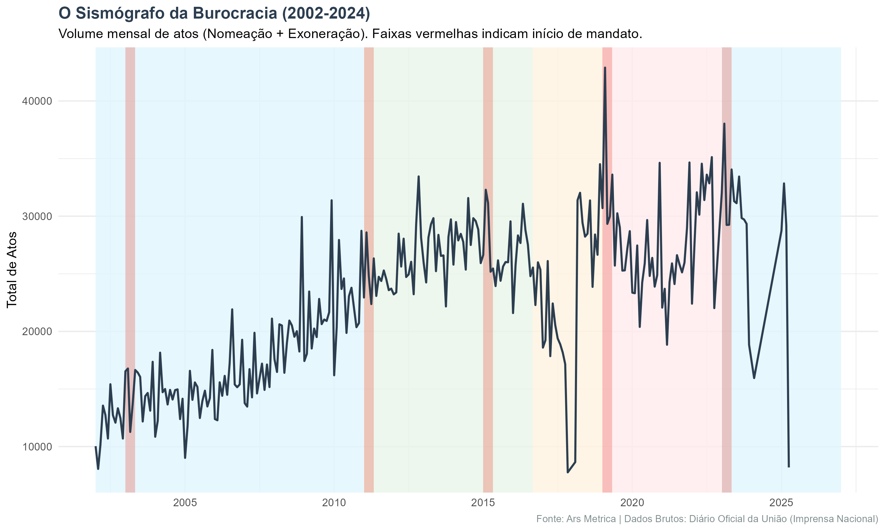
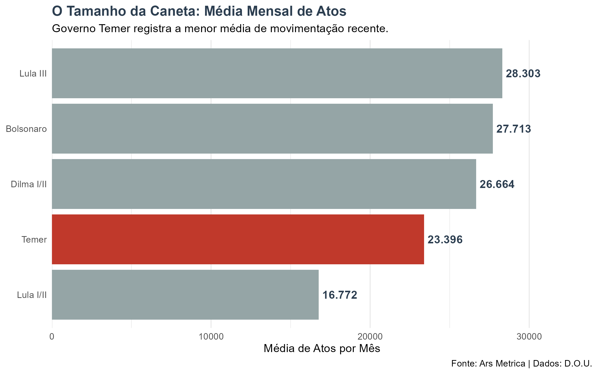

## O Diário "Secreto"

Você já tentou ler o Diário Oficial da União? Aliás, você tem ideia da dimensão do que é publicado ali todos os dias?

Imagine receber, religiosamente às 6 da manhã, um volume de 2.000 páginas escrito em "juridiquês", sem índice, sem gráficos e sem tabelas. Nele, diluídas em um mar de texto, estão as decisões que movem o país: quem entra, quem sai e quanto isso custa.

Para um analista humano, acompanhar o ritmo da máquina pública apenas lendo esses PDFs é uma tarefa impossível. Foi essa curiosidade — somada a uma dose de inquietação — que motivou a criação do **Termômetro D.O.U.**, um pipeline de dados construído em **R** para tentar traduzir esse caos textual em inteligência política.

## O Que os Dados Sugerem?

Ao minerarmos atos administrativos das últimas duas décadas, começamos a enxergar padrões que desafiam algumas intuições. O governo não parece funcionar em velocidade constante; ele tem um pulso, e esse pulso parece obedecer a regras muito específicas.

Abaixo, convido você a explorar o **Painel Interativo** e tirar suas próprias conclusões.

::: {.column-page}
<iframe src="https://arsmetrica.shinyapps.io/atos_pessoal_dou/" width="100%" height="850px" style="border:none; border-radius: 4px; box-shadow: 0 4px 8px rgba(0,0,0,0.1);"></iframe>
:::

 

::: {.callout-tip appearance="simple"}
**Dica:** O painel é interativo. Se estiver no celular, [clique aqui para tela cheia](https://arsmetrica.shinyapps.io/atos_pessoal_dou/).
:::

### 1. O "Efeito Transição"
O primeiro padrão que salta aos olhos lembra um sismógrafo. Nossos dados indicam que, nos primeiros quatro meses de cada novo governo, o volume médio de trocas sobe cerca de **17%** acima da média histórica.

Parece haver um rito de passagem: a cada quatro anos, a máquina precisa trocar suas engrenagens de confiança para que a nova coalizão possa governar.

### 2. A "Caneta Assustada" (Crises Políticas)
Talvez o achado mais fascinante seja a anatomia das crises. Ao darmos um zoom de 4 meses antes e depois de grandes escândalos, notamos dois comportamentos opostos:

* **O Vale da Paralisia:** Em crises de governabilidade interna, como o Mensalão ou o Joesley Day, o gráfico desenha um "V". A movimentação cai abruptamente no mês do evento. É como se a "caneta" do governo congelasse, aguardando a poeira baixar.
* **O Pico de Recomposição:** Já em rupturas institucionais, como o Impeachment ou o 8 de Janeiro, vemos um "V invertido". A crise exige uma resposta rápida de ocupação de espaços e troca de comandos (especialmente na segurança e cargos de confiança), gerando picos de atividade.

### 3. O Freio de Arrumação (Governo Temer)
Ao compararmos as médias por presidente, confirmamos a tese da contração no Governo Temer (2016-2018).

Embora o governo Lula I/II (início dos anos 2000) tenha a menor média absoluta, **Temer representa uma quebra de tendência**. Ele freou a expansão observada no governo Dilma e manteve a máquina girando num ritmo significativamente menor do que veríamos posteriormente. Os dados sugerem que o discurso de austeridade (Teto de Gastos) teve reflexo direto no RH do estado.

### 4. O Choque da Pandemia
A hipótese do "choque exógeno" se confirma parcialmente. O gráfico em zoom da pandemia mostra um comportamento clássico de recuperação rápida.

Imediatamente após a declaração da pandemia (linha tracejada), houve uma queda brusca nas nomeações entre abril e maio de 2020. Contudo, a paralisia foi breve. Já em meados do ano, o volume de atos retomou os patamares normais, demonstrando a adaptação da burocracia ao trabalho remoto.

### 5. A Indiferença Econômica
Por fim, ao cruzarmos os dados com o **IPCA**, encontramos uma correlação praticamente nula (-0.01).

Isso reforça que a dinâmica de nomeações vive em uma "bolha política", ditada pelo calendário eleitoral e não pelos preços no supermercado.

## Um Alerta Vital: Volume $\neq$ Despesa

É crucial distinguir **agitação administrativa** de **impacto fiscal**.

O fato de um governo apresentar um pico no gráfico (como no 8 de Janeiro) significa que houve muita *troca* de cadeiras, mas não necessariamente aumento de despesa.

Na administração pública, as carreiras são assimétricas: a nomeação de um único Secretário Executivo (DAS-6) pode ter um custo financeiro superior à nomeação de dezenas de cargos operacionais. Portanto, **alta rotatividade não é sinônimo de inchaço da folha de pagamento**, mas sim de instabilidade ou reorientação política.

## Conclusão: O Relógio da Burocracia

A união dessas análises desenha um retrato complexo do Executivo Federal. Descobrimos que a "caneta" das nomeações ignora a inflação, mas treme diante de escândalos. Vimos que a máquina sente o golpe de crises sanitárias, mas se recupera rápido.

O próximo passo do **Ars Metrica** é sair do "quanto" para o "quem", aplicando algoritmos para identificar o peso hierárquico dessas milhares de assinaturas diárias e desenhar o verdadeiro mapa do poder em Brasília.

::: {.callout-note collapse="true"}
## Nota Técnica
Projeto desenvolvido em **R** (Web Scraping + Shiny). Dados preliminares.
[**GitHub**](https://github.com/andeliton/temometro_D.O.U.)
:::

